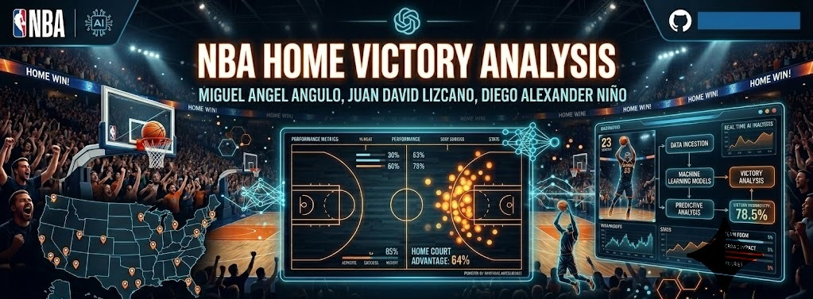

# NBA Home's wins Analysis

  

## Análisis de estadísticas de partidos de la NBA mediante exploración de datos, machine learning, deep learning y clusterización.

## Descripción del proyecto
Este proyecto corresponde al análisis de un dataset de estadísticas de partidos de la NBA, con el propósito de explorar los datos, identificar patrones relevantes en el desempeño de los equipos y aplicar técnicas de análisis y aprendizaje automático para estudiar el comportamiento de los encuentros.

El proyecto se desarrolló por fases. En una primera etapa, se realizó el preprocesamiento de los datos y la exploración del dataset mediante estadísticas descriptivas, con el fin de comprender su estructura y facilitar su análisis. En la segunda etapa, se analizaron las variables y se construyeron modelos de clasificación para determinar, a partir de las características disponibles, si el equipo local ganó o perdió el partido, así como para predecir el tipo de partido jugado. Finalmente, se aplicaron técnicas de reducción de dimensionalidad y clusterización para identificar patrones y comportamientos presentes en los datos.

## Objetivo del proyecto
Analizar un conjunto de datos de partidos de la NBA para identificar relaciones entre las estadísticas del juego y el comportamiento de los resultados, utilizando técnicas de exploración de datos y modelos de machine learning.

## Información del dataset
El archivo utilizado en el proyecto es:

- `game.xlsx`

Este dataset contiene información estadística de partidos de la NBA. Cada fila representa un partido y las columnas describen distintas variables asociadas al rendimiento de los equipos durante el encuentro.

El dataset incluye variables categóricas, temporales y numéricas relacionadas con cada partido de la NBA. Entre las variables categóricas se encuentran el equipo local (team_home), el equipo visitante (team_away), el resultado del equipo local (wl_home), el resultado del equipo visitante (wl_away) y el tipo de temporada (season_type). También incluye una variable temporal correspondiente a la fecha del partido (game_date).

En cuanto a las variables numéricas, se consideran estadísticas de rendimiento del equipo local como los tiros de campo anotados (fgm_home), los tiros libres anotados (ftm_home), los puntos totales (pts_home) y la diferencia en el marcador (plus_minus_home). De forma similar, para el equipo visitante se incluyen los tiros de campo anotados (fgm_away), los tiros libres anotados (ftm_away) y los puntos totales (pts_away).

En conjunto, estas variables permiten analizar el desempeño de los equipos, comparar el comportamiento entre local y visitante, estudiar el resultado de los partidos y construir modelos de clasificación o predicción según el objetivo del proyecto.

## Fases del proyecto

### Fase 1: Exploración y comprensión de los datos
En esta fase se realizó:
- revisión de la estructura del dataset
- identificación del significado de las variables
- limpieza básica de datos
- análisis exploratorio inicial
- observación de relaciones entre estadísticas del partido

### Fase 2: Aprendizaje supervisado
En esta fase se trabajó con:
- selección de variables relevantes
- preparación de datos para el análisis
- aplicación de modelos de machine learning y deep learning
- comparación de resultados entre enfoques

### Fase 3: Aprendizaje no supervisado
En esta fase se implementó:
- reducción de dimensionalidad por PCA
- clusterización por k-means
- clusterización por DBSCAN

## Herramientas utilizadas
- Python
- Google Colab
- Pandas
- NumPy
- Matplotlib / Seaborn
- Scikit-learn

## Cómo ejecutar el proyecto
Para ejecutar correctamente el notebook en Google Colab:

1. Abrir el archivo del proyecto en Colab.
2. Subir manualmente el archivo `game.xlsx`.
3. Cargar el archivo dentro del notebook mediante `files.upload()`.
4. Ejecutar las celdas en orden.

## Link del video
